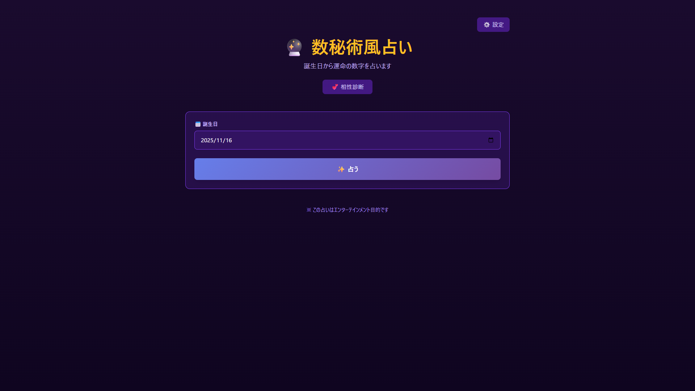

# 🔮 数秘術風占い（Numerology Fortune）

[](https://nextjs.org/)
[](https://www.typescriptlang.org/)
[](https://tailwindcss.com/)
[](https://vercel.com/)
[](https://web.dev/progressive-web-apps/)

誕生日から運命の数字を占う、神秘的なWebアプリケーションです。

## 🌐 デモ

**本番環境**: [https://app033-numerology-52reoo4mm.vercel.app](https://app033-numerology-52reoo4mm.vercel.app)

> ⚠️ **APIキー設定**: AI生成機能を使用するには、画面右上の「⚙️ 設定」から[Google AI Studio](https://ai.google.dev/)のAPIキーを設定してください。

## 📸 スクリーンショット

<div align="center">
  
</div>

## ✨ 特徴

- 📅 **誕生日入力**: カレンダーから簡単に選択
- 🔢 **ライフパスナンバー計算**: マスターナンバー（11, 22, 33）対応
- 🎨 **美しいアニメーション**: Framer Motionによる滑らかな表示
- 💕 **相性診断**: 2人のライフパスナンバーから相性を判定
- 🤖 **AI生成コンテンツ**: Google Gemini APIによる詳細な解説
- 💾 **ローカルストレージ**: 診断履歴とお気に入りの保存
- 📱 **PWA対応**: オフラインでも動作、インストール可能

## 🎯 主要機能

### 1️⃣ 数秘術計算

誕生日から以下を計算：
- **ライフパスナンバー**（1-9, 11, 22, 33）
- **性格診断**（長所・短所・適職）
- **今日の運勢**
- **ラッキーナンバー**

### 2️⃣ 相性診断

2人の誕生日から：
- **相性スコア**（0-100%）
- **星評価**（⭐1-5）
- **相性の良い点**
- **注意点とアドバイス**

### 3️⃣ AI生成コンテンツ（オプション）

Google AI Studio APIを使用：
- 数字の詳しい解説
- パーソナライズされたメッセージ
- 行動指針とアドバイス

> 💡 **APIキーなしでも使用可能**: デフォルトメッセージが表示されます

## 📊 技術スタック

- **フレームワーク**: Next.js 14 (App Router)
- **言語**: TypeScript 5
- **スタイリング**: Tailwind CSS
- **アニメーション**: Framer Motion
- **テスト**: Jest + React Testing Library + Playwright
- **PWA**: next-pwa
- **AI**: Google Gemini 2.5 Flash API
- **デプロイ**: Vercel

## 🚀 セットアップ

### 前提条件

- Node.js 18以上
- npm または pnpm
- （オプション）Google AI Studio APIキー

### インストール

```bash
# リポジトリをクローン
git clone https://github.com/takamiya1021/app033-numerology.git
cd app033-numerology

# 依存関係のインストール
npm install

# 開発サーバー起動
npm run dev
```

開発サーバーが起動したら、[http://localhost:3000](http://localhost:3000) にアクセスしてください。

### APIキー設定（オプション）

1. [Google AI Studio](https://ai.google.dev/) でAPIキーを取得
2. アプリ画面右上の「⚙️ 設定」ボタンをクリック
3. APIキーを入力して保存

> 💡 APIキーなしでもアプリは動作します（デフォルトメッセージが表示されます）

## 🧪 テスト

TDD（Test-Driven Development）に準拠して開発されています。

```bash
# 全テスト実行
npm test

# E2Eテスト実行
npm run test:e2e

# カバレッジ付きテスト
npm test -- --coverage

# ウォッチモード
npm run test:watch
```

**テスト結果**: 31+ テストがパス、コードカバレッジ 80%以上

## 📁 プロジェクト構造

```
app033-numerology/
├── app/                    # Next.js App Router
│   ├── page.tsx           # トップページ
│   └── compatibility/     # 相性診断ページ
├── components/            # Reactコンポーネント
│   ├── BirthdateInput.tsx
│   ├── LifePathNumber.tsx
│   ├── AIContentSection.tsx
│   └── SettingsModal.tsx
├── lib/                   # ビジネスロジック
│   ├── numerology.ts     # 数秘術計算
│   ├── aiService.ts      # AI API統合
│   └── storage.ts        # ローカルストレージ
├── hooks/                # カスタムフック
├── types/                # TypeScript型定義
├── public/               # 静的ファイル
│   ├── icon-192.png     # PWAアイコン
│   ├── icon-512.png
│   └── manifest.json    # PWA設定
└── doc/                 # ドキュメント
    ├── requirements.md
    ├── technical-design.md
    └── implementation-plan.md
```

## 🎨 デザインシステム

### カラーパレット

- **メイン**: 神秘的な紫系（`#7C3AED`, `#6D28D9`）
- **アクセント**: 金色（`#F59E0B`, `#FBBF24`）
- **背景**: ダークグラデーション（`#1a0b2e` → `#0f0520`）

### アニメーション

- 計算過程の段階的表示
- ライフパスナンバーのスケールアニメーション
- キラキラエフェクト
- スムーズなトランジション

## 📱 PWA機能

- **オフライン対応**: 数秘術計算はオフラインでも動作
- **インストール可能**: ホーム画面に追加
- **レスポンシブ**: モバイル・タブレット・デスクトップ対応
- **アプリアイコン**: 192x192 / 512x512対応

## 🛠️ ビルド & デプロイ

```bash
# プロダクションビルド
npm run build

# ローカルで本番環境を起動
npm start

# Vercelにデプロイ
npx vercel --prod
```

## 📝 開発ドキュメント

- [要件定義書](doc/requirements.md)
- [技術設計書](doc/technical-design.md)
- [実装計画書](doc/implementation-plan.md)

## 🤝 コントリビューション

プルリクエストを歓迎します！

1. このリポジトリをフォーク
2. 新しいブランチを作成（`git checkout -b feature/amazing-feature`）
3. 変更をコミット（`git commit -m 'Add amazing feature'`）
4. ブランチにプッシュ（`git push origin feature/amazing-feature`）
5. プルリクエストを作成

## 📄 ライセンス

MIT License - 詳細は [LICENSE](LICENSE) ファイルを参照してください。

## 👨‍💻 作者

**Hiroaki Yoshikura**

- GitHub: [@takamiya1021](https://github.com/takamiya1021)

## 🙏 謝辞

- [Next.js](https://nextjs.org/) - Reactフレームワーク
- [Tailwind CSS](https://tailwindcss.com/) - CSSフレームワーク
- [Framer Motion](https://www.framer.com/motion/) - アニメーションライブラリ
- [Google AI Studio](https://ai.google.dev/) - AI API

---

**⚠️ 注意**: この占いはエンターテインメント目的です。
